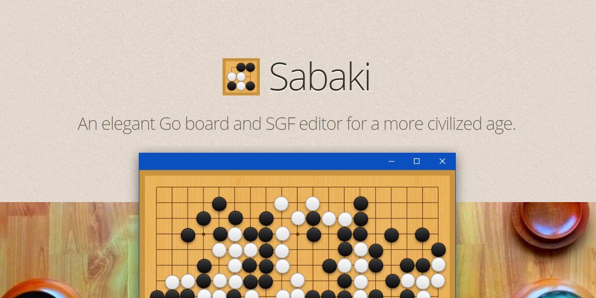
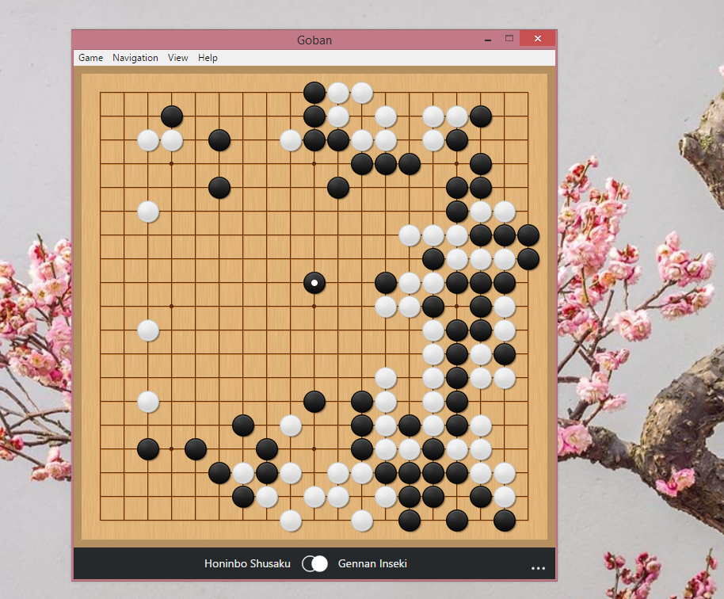

# 

## Features

- Fuzzy stone placement
- Read and save SGF games and collections, open wBaduk NGF and Tygem GIB files
- Display formatted SGF comments using a
  [subset of Markdown](https://github.com/SabakiHQ/Sabaki/blob/master/docs/guides/markdown.md)
  and annotate board positions & moves
- Personalize board appearance with
  [textures & themes](https://github.com/SabakiHQ/Sabaki/blob/master/docs/guides/theme-directory.md)
- SGF editing tools, including lines & arrows board markup
- Copy & paste variations
- Powerful undo/redo
- Fast game tree
- Score estimator & scoring tool
- Find move by move position and comment text
- [GTP engines](https://github.com/SabakiHQ/Sabaki/blob/master/docs/guides/engines.md)
  support with
  [board analysis for supported engines](https://github.com/SabakiHQ/Sabaki/blob/master/docs/guides/engine-analysis-integration.md)
- Guess mode
- Autoplay games

## Documentation

For more information visit the
[documentation](https://github.com/SabakiHQ/Sabaki/blob/master/docs/README.md).
You're welcome to
[contribute](https://github.com/SabakiHQ/Sabaki/blob/master/CONTRIBUTING.md) to
this project.

## Building & Tests

See
[Building & Tests](https://github.com/SabakiHQ/Sabaki/blob/master/docs/guides/building-tests.md)
in the documentation.

## License

This project is licensed under the
[MIT license](https://github.com/SabakiHQ/Sabaki/blob/master/LICENSE.md).

## Donators

A big thank you to these lovely people:

- Eric Wainwright
- Michael Noll
- John Hager
- Azim Palmer
- Nicolas Puyaubreau
- Hans Christian Poerschke
- David Göbel
- Dominik Olszewski
- Brian Weaver
- Philippe Fanaro
- James Tudor
- Frank Orben
- Dekun Song
- Dimitri Rusin
- Andrew Thieman
- Adrian Petrescu
- Karlheinz Agsteiner
- Petr Růžička
- Sergio Villegas
- Jake Pivnik

## Related

- [Shudan](https://github.com/SabakiHQ/Shudan) - A highly customizable,
  low-level Preact Goban component.
- [boardmatcher](https://github.com/SabakiHQ/boardmatcher) - Finds patterns &
  shapes in Go board arrangements and names moves.
- [deadstones](https://github.com/SabakiHQ/deadstones) - Simple Monte Carlo
  functions to determine dead stones.
- [go-board](https://github.com/SabakiHQ/go-board) - A Go board data type.
- [gtp](https://github.com/SabakiHQ/gtp) - A Node.js module for handling GTP
  engines.
- [immutable-gametree](https://github.com/SabakiHQ/immutable-gametree) - An
  immutable game tree data type.
- [influence](https://github.com/SabakiHQ/influence) - Simple heuristics for
  estimating influence maps on Go positions.
- [sgf](https://github.com/SabakiHQ/sgf) - A library for parsing and creating
  SGF files.
